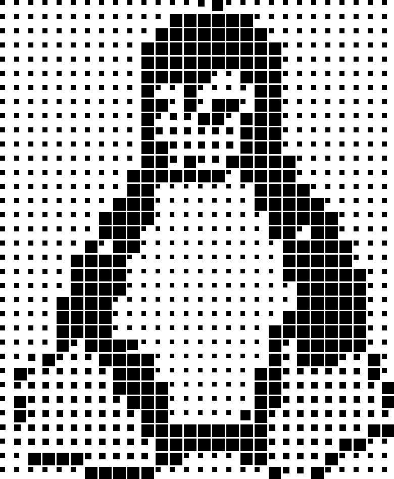

This script rasterizes an input image.Specifically, it breaks the image into equal-sized tiles and draws a black area in the top-left corner of each tile. The size of the black region depends on the pixel value at the corresponding position of the original image (gray value), the darker the color (lower gray value), the larger the black region. In addition, the size of the black area of the blank tiles (tiles with gray value 255) can be set using the min_black_size parameter.

